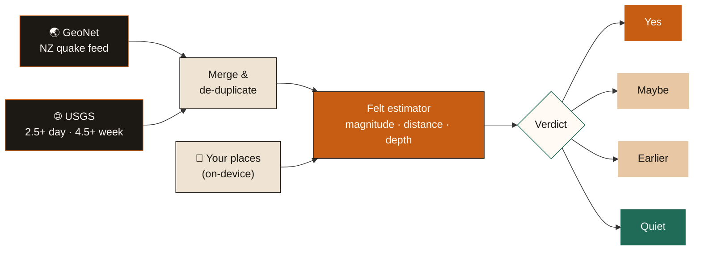

<div align="center">


<br />
<br />

### &nbsp;*The two-second answer for the rooms you love.*&nbsp;

<br />

<a href="https://chuhandeng.github.io/FELT/"></a>

<br />
<br />


<br />
<br />

**[The idea](#-the-idea)** &nbsp;·&nbsp; **[The answers](#-four-answers-no-jargon)** &nbsp;·&nbsp; **[Features](#-features)** &nbsp;·&nbsp; **[How it thinks](#-how-felt-thinks)** &nbsp;·&nbsp; **[Run it](#-run-it)** &nbsp;·&nbsp; **[Privacy](#-privacy)** &nbsp;·&nbsp; **[Design](#-design)**

</div>

<br />

> [!IMPORTANT]
> **Felt is an estimate, not a warning.** It is not a GeoNet MMI and not a USGS ShakeMap. If the ground is still moving: **drop, cover, hold on** — *then* read the official record.

<br />

## ◐ The idea

Every quake app shows you a **magnitude**. Magnitude is the size of the *earthquake*. It says very little about whether the cup on **your** kitchen bench just rattled.

A magnitude 6.5 that is 400 km away and 90 km deep can be a shrug. A shallow magnitude 4 right under the house can make you spill your tea. **Felt closes that gap.** You tell it which places matter — home, your mum's, the night shift — and it answers one question for each of them:

<div align="center">

### *“Was that an earthquake?”*

</div>

No maps to squint at. No wall of numbers. A plain answer in about two seconds, then a way to tell the people you love.

<br />

## ◑ Four answers, no jargon

<div align="center">

</div>

<br />

| Seal | When it appears | What it means |
| :--- | :--- | :--- |
| 🟠 **Yes** | Something in the **last 30 minutes** scores **≥ 2.7** at your place | You very likely felt it. Severe shakes add *drop, cover, hold on*. |
| 🟤 **Maybe** | Something in the last 30 minutes scores **1.85 – 2.7** | Right on the edge of noticing — only if you were sitting still. |
| 🟤 **Earlier** | Nothing right now, but within the **last 18 hours** something scored **≥ 2.7** | Not this minute — but earlier, your place would have felt it. |
| 🟢 **Quiet** | Nothing close enough or strong enough | If the window rattled, it was probably a truck. |

<br />

## ✦ Features

<table>
<tr>
<td width="50%" valign="top">

#### 🏠 &nbsp;Answers for *your* rooms
Save up to **eight places** — pick from 33 built-in cities or use *where I am*. Rename them anything you like: “Home”, “Mum”, “Night shift”.

#### 🌊 &nbsp;Two live feeds, one clean list
Pulls **GeoNet** (New Zealand) and **USGS** (worldwide) in parallel, then merges and de-duplicates so one quake never shows up twice.

#### 📡 &nbsp;Reach radar
A canvas radar shows which quakes could actually reach your place, alongside a 24-hour ribbon of the largest magnitude each hour.

</td>
<td width="50%" valign="top">

#### 🔔 &nbsp;Stay with it
Leave the tab open. If the answer flips to **Yes**, the tab title changes — turn on *listen* and a soft two-note tone plays too.

#### 📓 &nbsp;It learns your floor
Tap **I felt it** or **Not me**. After a few entries Felt tells you where *your* notice line sits — kept on your device, never uploaded.

#### 💬 &nbsp;Text the group
One tap shares a plain-language summary for **every** place you saved — via the native share sheet, or copied to your clipboard.

</td>
</tr>
</table>

<details>
<summary><b>Also in the box</b> &nbsp;·&nbsp; <i>the small things</i></summary>

<br />

- 📲 **Installable PWA** — add to your home screen on iOS or Android; opens without the browser bar
- ✈️ **Works offline** — a service worker caches the app shell and falls back gracefully when you have no signal
- 🔁 **Auto-refresh** every 60 seconds while the tab is visible, plus a manual *Refresh*
- 🌐 **Resilient fetching** — each feed has an 8-second timeout, and if one source goes down Felt says which one “didn't answer” and keeps working with the other
- 🌊 **Tsunami flag surfaced** — if the official record carries one, Felt tells you to check that source (it never issues warnings itself)
- 🧭 **Compass bearings** — every quake reads like “120 km away NE, 4 min ago” instead of raw coordinates
- 🕳️ **Depth-aware wording** — deep quakes get a note that the magnitude looks louder than the shake
- 📱 **Mobile-first layout** — a bottom section dock on phones, safe-area padding for notches, and `prefers-reduced-motion` respected

</details>

<br />

## ✺ How Felt thinks



### The estimator

For every quake and every place, Felt computes a score from **0 to 10** using the quake's magnitude `M`, the straight-line distance to the epicentre, and the depth:

```text
hypocentral distance  =  √(distance² + depth²)

score  =  3.15  +  1.22·M  −  2.85·log₁₀(hypocentral)  −  0.002·hypocentral

below M4   →  score −= (4 − M) × 0.55         // small quakes fade fast
below M3   →  capped at 2.55                  // can never read as a clear shake
below M2.2 →  capped at 1.4                   // can never be noticed at all
```

The score is then translated into words a person would actually say:

| Score | Band | What Felt tells you |
| :---: | :--- | :--- |
| `< 1.85` | **Not felt** | Too faint to notice. |
| `< 2.70` | **Maybe** | Only if you were sitting still. |
| `< 3.60` | **Light jolt** | A small startle. Hanging things might sway. |
| `< 4.50` | **Clearly felt** | Most people indoors notice. Windows can rattle. |
| `< 5.40` | **Strong** | Everyone feels it. Dishes can shift. |
| `< 6.30` | **Hard shake** | Hard to keep your footing. Check on people nearby. |
| `≥ 6.30` | **Severe** | Serious near the epicentre. Follow local civil defence. |

<details>
<summary><b>See it in action</b> &nbsp;·&nbsp; <i>what each magnitude feels like at a typical 15 km depth</i></summary>

<br />

| Magnitude | 10 km away | 50 km away | 100 km away | 300 km away |
| :---: | :---: | :---: | :---: | :---: |
| **M3** | Maybe | Not felt | Not felt | Not felt |
| **M4** | Clearly felt | Light jolt | Maybe | Not felt |
| **M5** | Hard shake | Clearly felt | Light jolt | Not felt |
| **M6** | Severe | Hard shake | Strong | Light jolt |
| **M7** | Severe | Severe | Hard shake | Clearly felt |

*Computed straight from the formula above. It is a rough model — real shaking depends on local geology, building type and which floor you are on.*

</details>

### Where the data comes from

| Source | Endpoint | Used for |
| :--- | :--- | :--- |
| 🇳🇿 **[GeoNet](https://www.geonet.org.nz/)** | `api.geonet.org.nz/quake?MMI=1` | Detailed New Zealand coverage. Preferred when both feeds report the same event. |
| 🌐 **[USGS](https://earthquake.usgs.gov/earthquakes/map/)** | `2.5_day.geojson` + `4.5_week.geojson` | Worldwide coverage — everything M2.5+ today, everything M4.5+ this week. |

Two reports are treated as the **same quake** when they fall within 90 seconds, 0.7 magnitude units and 60 km of each other.

<br />

## ➤ Run it

Felt is plain HTML, CSS and JavaScript. **There is nothing to install and nothing to build.**

```bash
git clone https://github.com/YOUR-USERNAME/FELT.git
cd FELT

# any static server works — Python is already on most machines
python3 -m http.server 8080
```

Then open **http://localhost:8080**.

> [!TIP]
> Service workers only run on `localhost` or HTTPS, so use a local server rather than double-clicking `index.html` if you want to test offline mode and installation.

### Deploy to GitHub Pages

1. Push the repo to GitHub.
2. Go to **Settings → Pages**.
3. Under **Build and deployment**, choose **Deploy from a branch**, select `main` and `/ (root)`, and hit **Save**.
4. Your app goes live at `https://YOUR-USERNAME.github.io/FELT/` within a minute or two.

A `.nojekyll` file is already included so GitHub serves the files exactly as they are.

### Put it on your phone

| 🍎 iPhone / iPad | 🤖 Android |
| :--- | :--- |
| 1. Open the app in **Safari**<br/>2. Tap the **Share** button<br/>3. Choose **Add to Home Screen**<br/>4. Open Felt from the icon | 1. Open the app in your browser<br/>2. Open the **browser menu**<br/>3. Choose **Install app** (or *Add to Home screen*)<br/>4. Felt opens without the browser bar |

<br />

## ▤ Project structure

```text
FELT/
├── index.html              # tiny shell — fonts, meta, and a #app mount point
├── app.js                  # everything: estimator, feeds, UI, radar canvas, journal
├── styles.css              # design tokens + layout (mobile-first)
├── sw.js                   # service worker — offline app shell, network-first
├── manifest.webmanifest    # PWA metadata (name, colours, icons)
├── favicon.svg             # vector mark
├── .nojekyll               # tells GitHub Pages to skip Jekyll
└── assets/
    ├── strata.jpg          # hero — layered stone split by an amber vein
    ├── cup.jpg             # the cup with one ripple
    └── mark.jpg            # home-screen icon
```

<br />

## 🔒 Privacy

Felt was built to need **nothing from you**.

- **No accounts. No sign-up. No analytics.**
- Your **places**, your **yes/no log** and your **listen** setting live in your browser's `localStorage` under `felt.v1.*` and **never leave the device**.
- *Use where I am* reads your location once, in your browser, to save coordinates locally. They are never sent anywhere.
- The only network requests are to **GeoNet** and **USGS** for quake data, and to **Google Fonts** for the typefaces.

<br />

## 🎨 Design

Felt is meant to feel like a quiet room, not a control panel — warm stone, a single amber vein, and a mineral green for *all is well*.

<div align="center">

</div>

<br />

| | |
| :--- | :--- |
| **Display** | [**Fraunces**](https://fonts.google.com/specimen/Fraunces) — a soft, characterful serif, set in italic for the wordmark, the seals and your personal notes |
| **Interface** | [**Outfit**](https://fonts.google.com/specimen/Outfit) — clean geometric sans for labels, meta and buttons |
| **Texture** | A faint 7 px dot-grid on warm stone, like good paper |
| **Motion** | Restrained — a slow green pulse on the *Live* dot, and not much else |

<br />

## ⚠ Disclaimer

Felt gives a **rough estimate** from magnitude, distance and depth. It is **not** an official warning system and must never be relied on for safety decisions. For authoritative information, always use the official sources:

**[GeoNet](https://www.geonet.org.nz/)** &nbsp;·&nbsp; **[USGS Earthquakes](https://earthquake.usgs.gov/earthquakes/map/)** &nbsp;·&nbsp; your local civil defence

<br />

<div align="center">


<br />

*Magnitude is the quake. **Felt** is whether your kitchen noticed.*

<sub>Live earthquake data courtesy of <a href="https://www.geonet.org.nz/">GeoNet</a> and the <a href="https://www.usgs.gov/">U.S. Geological Survey</a>.</sub>

</div>
